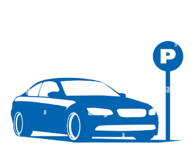

#  PARKING APP

  <h2>Javier Sánchez González</h2>
  
  

## Resumen

La aplicación **APP PARKING** está diseñada para facilitar la gestión de reservas de estacionamiento. Permite a los usuarios registrarse, iniciar sesión, y reservar espacios de estacionamiento. Además, los usuarios pueden ver su historial de reservas y gestionar sus vehículos. La aplicación cuenta con un sistema de recuperación de contraseña y una interfaz gráfica amigable para una mejor experiencia de usuario.

## Estructura del Proyecto

El proyecto se divide en tres paquetes principales: `controlador`, `modelo` y `vista`, cada uno conteniendo clases específicas para su propósito en la aplicación.

### Paquete controlador
Maneja la lógica de negocio y la interacción con la base de datos.
<!-- Lista de clases con descripciones -->

### Paquete modelo
Define las entidades utilizadas en la aplicación.
<!-- Lista de clases con descripciones -->

### Paquete vista
Gestiona la interfaz de usuario y la interacción con el usuario.
<!-- Lista de clases con descripciones -->

## Instalación

Para instalar **APP PARKING**, sigue estos pasos:

1. Clona el repositorio en tu máquina local utilizando `git clone [url-del-repositorio]`.
2. Asegúrate de tener instalado Java JDK 8 o superior.
3. Importa el proyecto en tu IDE favorito (se recomienda IntelliJ IDEA o Eclipse).
4. Resuelve las dependencias o librerías faltantes, si las hay.
5. Ejecuta el archivo `Load.java` para iniciar la aplicación.

## Uso

Una vez instalada la aplicación, puedes:

- **Registrar una nueva cuenta**: Abre la aplicación y dirígete a la opción de registro para crear una nueva cuenta.
- **Iniciar sesión**: Si ya tienes una cuenta, simplemente ingresa tus credenciales para acceder a las funciones de la aplicación.
- **Reservar estacionamiento**: Navega a la sección de reservas y elige el espacio de estacionamiento que deseas reservar.
- **Ver historial**: Consulta tu historial de reservas para llevar un seguimiento de tus movimientos.
- **Gestionar cuenta y vehículos**: Accede a la configuración de tu cuenta para actualizar tus datos o añadir y eliminar vehículos.

Para más información, consulta la documentación adjunta o contacta al equipo de soporte.

